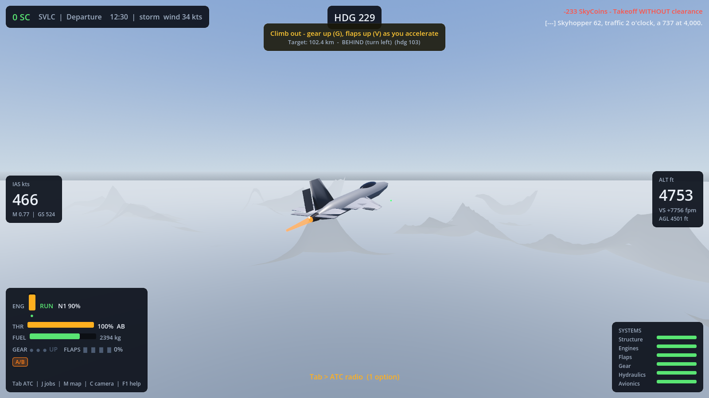

# Stormfighter Flight Sim

A realistic flight simulator built in **Godot 4.7** — 18 aircraft with real-world specs, a
real-scale archipelago with 10 airports, automated ATC, a SkyCoins economy that rewards
airmanship and punishes recklessness, damage & random failures, jobs, and player-hosted
P2P multiplayer. Runs in the browser and as a native Windows app with identical physics.

**[▶ Play in your browser](https://hardcoregamingsyle.github.io/stormflight-sim/play/)** ·
**[⬇ Download for Windows (.exe)](https://github.com/hardcoregamingsyle/stormflight-sim/releases/latest/download/StormfighterFlightSim.exe)** ·
**[Landing page](https://hardcoregamingsyle.github.io/stormflight-sim/)**

## Features

- **Component-buildup flight model** — every wing panel, tail surface and fin computes its own
  local airflow, so stalls, sideslip, roll/pitch/yaw damping, ground effect, transonic drag rise
  and crosswind behaviour all emerge from the aerodynamics rather than scripted rates.
  Raycast landing gear with per-wheel suspension, tire grip, brakes and nosewheel steering.
- **Fuel, weight & fluid physics** — multi-tank fuel (wing cells + centre tank) with real mass
  at real positions: the centre of mass and inertia move as fuel burns, engines feed from their
  own wing (an engine-out slowly builds a lateral imbalance you must trim against), and fuel
  visibly sloshes in partially-filled tanks during uncoordinated flight. Ditching physics with
  buoyancy and hydrodynamic drag: hit the sea fast and it's concrete, slow and you float —
  briefly. Flipping onto your back on the ground is an instant crash, as it should be.
- **18 aircraft** with researched real-world numbers (mass, thrust, wing geometry, speeds):
  Cessna 172 (free starter), A320, A321, 737 MAX 8, 757, A340, A350, 747, A380, An-124, An-225,
  F-16, A-10, F-35, F-22, Bell 206, UH-60, CH-47 Chinook. Procedurally modelled with animated
  ailerons, elevators, rudders, Fowler flaps, slats, spoilers, retracting gear, spinning
  props/fans/rotors, afterburner glow and full nav lighting.
- **The Meridian Isles** — a real-scale procedural region (~400 km across) with 10 airports
  50–230 km apart: mega-hub, internationals, a military airbase, mountain/desert/arctic strips.
  Runway markings, taxiway routing graphs, PAPI glideslope lights, approach lighting, windsocks,
  day/night cycle and weather with gusting wind.
- **Automated ATC** — clearance delivery, taxi routing to an into-wind runway, hold short,
  line-up-and-wait, departure handoff, cruise altitude, approach vectors, landing clearance,
  taxi to an assigned random gate, go-arounds and MAYDAY priority handling.
- **SkyCoins economy** — a judgement tick every 15–30 s: passive flight pay, clean-flying and
  ATC-compliance bonuses, landing quality scoring (butter < 200 fpm!), penalties for taxi
  speeding, runway incursions, off-route taxiing, 250-kt bust below 10,000 ft, over-G,
  overspeed, flying around with gear down, and crashing. Jobs (cargo, charters, medical
  express, ferry, patrol) pay by distance, payload and urgency.
- **Damage & failures** — per-system wear (structure, engines, flaps, gear, hydraulics,
  avionics) accelerated by abuse; low health raises the odds of flameouts, jammed flaps,
  stuck gear (gravity-drop with hold-G), hydraulic degradation and avionics faults.
  Repair and refuel in the hangar.
- **P2P multiplayer** — no dedicated server: a desktop player hosts (WebSocket, TCP 9080),
  others join by IP. Shared deterministic world, interpolated remote aircraft with real
  collisions, chat, periodic time sync.

## Controls

| Key | Action | Key | Action |
|---|---|---|---|
| W / S | Throttle (heli: collective) | G | Gear (hold = emergency drop) |
| A / D | Roll + nosewheel steering (heli: cyclic roll) | F / V | Flaps down / up |
| Arrows | Pitch (Up/Down) & roll (Left/Right) | H | Spoilers / speedbrake |
| Q / E | Rudder pedals (heli: tail rotor) | | |
| , / . | Pitch trim | B / N | Brakes / parking brake |
| I | Engines | U | Pushback tug |
| X | Autopilot | C | Camera views |
| Tab | ATC menu (1–9 to reply) | J | Jobs board |
| M | Map | F1 | Help |

## Building from source

1. Install [Godot 4.7](https://godotengine.org/download) + export templates.
2. Clone, then `godot --headless --import .`
3. Run: `godot` (or `godot -- --smoketest` for the headless physics test).
4. Export: `godot --headless --export-release "Windows Desktop"` / `"Web"`.

Sounds are procedurally generated (`python tools/make_audio.py`); the aircraft database is
generated from researched specs (`python tools/gen_aircraft_db.py data/aircraft_specs.json`).

## Multiplayer notes

- Hosting requires the desktop build (browsers can't listen on sockets). LAN works out of the
  box; for internet play forward TCP 9080.
- Browser clients can join only from http-served pages (browser mixed-content rules block
  `ws://` from `https://`) — for guaranteed multiplayer use the desktop app.

## License

MIT — see [LICENSE](LICENSE).
